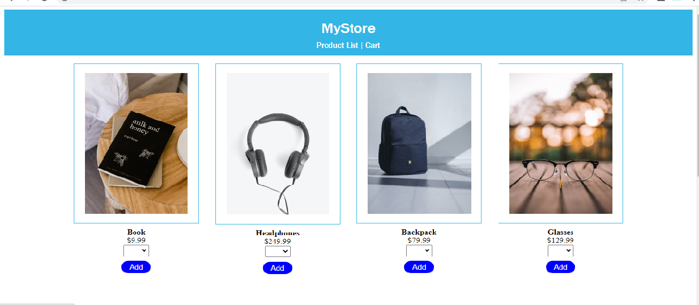

# MyStore
This is a fullstack project using angular and dummy data(json).
I used localstorage to store data.

## Getting Started
Run `npm install` to install all the packages to your pc

## Development server

Run `ng serve` for a dev server. Navigate to `http://localhost:4200/`. The application will automatically reload if you change any of the source files.

